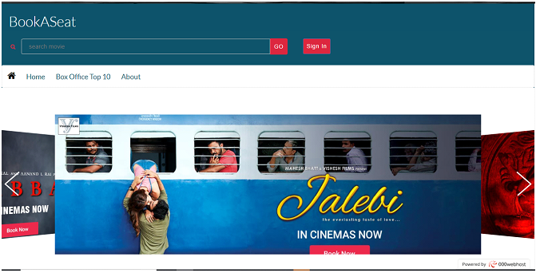
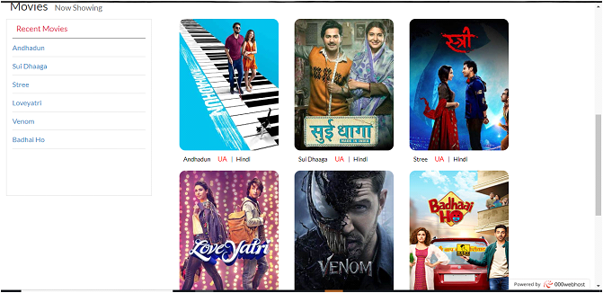
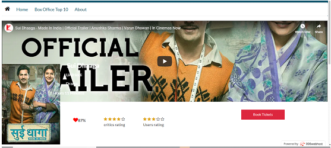
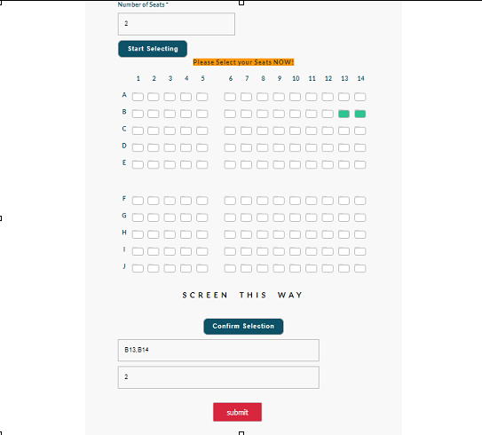
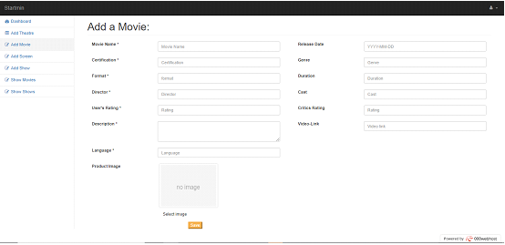
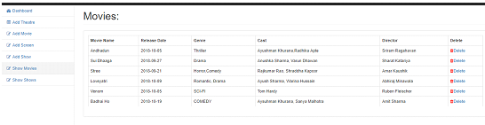

PROJECT DESCRIPTION

BOOKASEAT

This project is basically a website that provides a user interface to customers to book tickets for any movie in a theatre, the customer can choose seats from any show that is available in any theatre that is currently havings shows of that movie. 

In the website an admin side has been maintained to maintain the website as admin is the person responsible for adding shows, theatre, screens and movies. 

Database used in the project was phpMySQL which is very efficient and easy to use and easy to connect to via php coding.The names of movies,the details of any movie, its shows, seats for the show, payment and ticket generation is handled by php and is entirely dependent on database.
Efficient and correct database design was the key to proper and efficient working of this website and using the database in such a way that all functionalities of this project are maintained has been achieved

Functionalities of the project :

⦁	User side to book tickets 

⦁	All Details of any movie to be shown to user

⦁	Shows of any movie from any theater should be available to user to book from

⦁	User should be able to book seats

⦁	User should be able to see the tickets which he/she just booked seats for

⦁	Admin side for addition and deletion of movies, shows, screens and theatres

⦁	All the details properly managed by admin 

SCREENSHOT OF USER INTERFACE

USER SIDE

1.Home page

2.Select Movie

3.Watch Trailer

4.Select Seats

ADMIN SIDE

5.Add Movies

6.Show already existing Movies 

Note: These are screenshots of some important functions.

